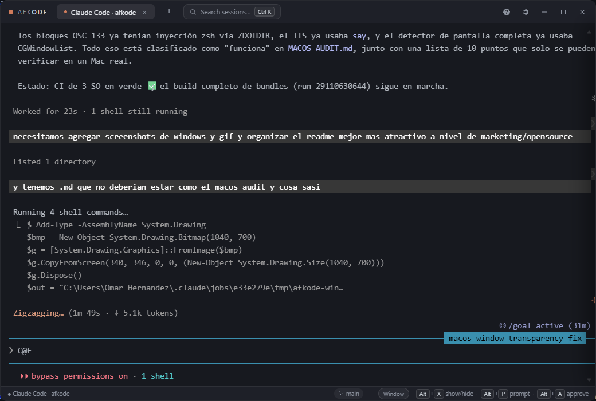

<div align="center">


# AFKode

**Your AI codes while you play.**

An in-game overlay to supervise AI coding agents — Claude Code, OpenCode, Codex, or any terminal — without leaving your game. Press `Alt+X`, check on your agent, approve, go back to the match.

[](https://github.com/ohernandezdev/afkode/releases)
[](https://github.com/ohernandezdev/afkode/releases)
[](https://github.com/ohernandezdev/afkode/actions/workflows/ci.yml)
[](LICENSE)


**[ohernandezdev.github.io/afkode](https://ohernandezdev.github.io/afkode/)**



*A real session: AFKode supervising Claude Code (which is auditing AFKode's own codebase).*

<!-- TODO(media): hero GIF over a game — Alt+X toggle, ghost mode, approve from the HUD. See docs/MEDIA.md for the shot list. -->

</div>

## Why AFKode?

- 🎮 **Never leave your game.** The overlay floats above windowed/borderless games. `Alt+X` toggles it instantly — no alt-tab, no FPS hit (Tauri + WebGL rendering, ~2 MB installer).
- 🤖 **Your agent's real state, not a guess.** Claude Code sessions launch with injected hooks that report exactly which tool is running, when it waits for your permission, and when a turn ends — all local (127.0.0.1).
- ⚡ **Approve without opening anything.** `Alt+A` answers the pending permission prompt from anywhere. The mini-HUD pill shows 🟠 working · 🟡 waiting · 🟢 done while the overlay is hidden.
- 🔕 **Knows when you're in a match.** Fullscreen game focused → notifications go silent and queue in an inbox; one ping when you're back in the lobby.
- 💬 **Talk to it from a Spotlight-style palette.** `Alt+P`, type the task, Enter — it lands in the right session, with history, `/command` and `@file` autocomplete.
- 🧱 **A real terminal underneath.** ConPTY/PTY, truecolor, interactive TUIs, Warp-style command blocks (OSC 133), search, themes.

## Install

| OS | How |
|---|---|
| **Windows** | `winget install OmarHernandez.AFKode` — or the NSIS installer from [Releases](https://github.com/ohernandezdev/afkode/releases) |
| **macOS** | Download the `.dmg` from [Releases](https://github.com/ohernandezdev/afkode/releases), drag to Applications. Unsigned for now: right-click → Open on first launch (or `xattr -dr com.apple.quarantine /Applications/AFKode.app`) |
| **Linux** | `.AppImage` (self-updating) or `.deb`/`.rpm` from [Releases](https://github.com/ohernandezdev/afkode/releases) |

AFKode checks for updates on startup and installs them after you confirm (signed updater artifacts). Agent CLIs (Claude Code, OpenCode, Codex) are detected on your system; install the ones you want with their official instructions and their launcher buttons appear.

## Hotkeys

Global (work from inside your game):

| Hotkey | Action |
|---|---|
| `Alt + X` | Show / hide the overlay |
| `Alt + G` | Ghost mode: translucent overlay, clicks pass through to the game |
| `Alt + P` / `Ctrl + Alt + P` | Prompt palette: type a task, it goes to the active agent |
| `Alt + A` | Approve: answer "yes" to the agent waiting for permission, without opening the overlay |
| `Alt + N` | Toggle do-not-disturb manually (lobbies are fullscreen too); auto-resets when the game closes |

On macOS, `Alt` is the **Option (⌥)** key: `⌥X`, `⌥G`, `⌥P` / `⌃⌥P`, `⌥A`, `⌥N`.

In-app:

| Windows / Linux | macOS | Action |
|---|---|---|
| `Ctrl+F` | `⌘F` | Search the terminal scrollback |
| `Ctrl+K` | `⌘K` | Search open sessions |
| `Ctrl+V` | `⌘V` | Paste (clipboard image → temp PNG path for the agent) |
| — | `⌘C` | Copy the selection (`Ctrl+C` stays SIGINT) |
| `Ctrl+Shift+C` | `⌘⇧C` | Copy selection, or the selected block's output |
| `Ctrl+↑/↓` | `⌘↑/↓` | Jump between command blocks |
| `Shift+Enter` | `Shift+Enter` | Literal newline in agent TUIs (no submit) |

On macOS, `Ctrl+F`, `Ctrl+K` and `Ctrl+V` pass through to the shell (they are readline editing keys there).

## Features

### Supervise your agents

- **Real agent integration (Claude Code hooks)**: sessions launch with injected hooks reporting exact state to a local listener — which tool runs, when it waits for permission, when a turn ends. The HUD, `Alt+A` and the summary are exact, not guessed. Other CLIs fall back to text heuristics. Optional (⚙, on by default).
- **Mini-HUD**: a tiny draggable pill, visible while the overlay is hidden: 🟠 working · 3:42 / 🟡 waiting for you / 🟢 done. Grows a ↩ quick-reply button when an agent waits.
- **Do-not-disturb in match**: while a fullscreen game holds focus, AFKode stays silent; pending items queue in the **between-matches inbox** (approve/jump per row) and one ping fires when silence lifts.
- **"While you were away" summary**: coming back after 2+ minutes shows turns completed, tools run, files touched, and how long agents sat waiting for you.
- **Agent-aware notifications**: overlay hidden + agent finishes or blocks on input → native toast + optional beep, or **voice announcements (TTS)** copilot-style over your game audio.
- **Prompt palette with autocomplete**: history (↑), Claude Code `/commands`, and `@file` completion against the session's folder (Tab).

### A terminal built for this

- **Real terminal (ConPTY/PTY)**: truecolor, interactive apps, GPU-rendered (WebGL). Copy-on-select, right-click copy/paste, drag & drop of files/folders.
- **Command blocks (Warp-style)**: shell tabs group each command + its output into a block via OSC 133 shell integration (injected at spawn — your profile files are never edited). Colored gutter per block (green ✓ / red ✗), hover toolbar (copy command/output/both, re-run), keyboard navigation. Automatic for PowerShell (Windows), bash (Linux) and zsh (macOS/Linux); [other shells can opt in](#command-blocks-in-other-shells). Agent TUI tabs are unaffected.
- **Tabs**: parallel sessions (Claude Code, OpenCode, Codex, your shell) — rename, color tags, live state dots, `Ctrl+K` session search.
- **Git footer**: branch, `+added/-removed` and dirty indicator for the active session's folder.
- **CLI detection**: launchers offer exactly the agents installed on your system — undetected CLIs simply don't get a button.
- **Clipboard image paste**: `Ctrl+V` with a screenshot on the clipboard saves it to a temp PNG and hands the path to the agent.

### Made to disappear

- **System tray**: left-click toggles the overlay, right-click opens the menu. The window's × hides to the tray instead of closing.
- **Ghost mode**: the overlay stays visible as a translucent HUD while clicks and keys go to the game.
- **Overlay ↔ window mode**: always-on-top borderless overlay for gaming, or a normal taskbar window when you're not.
- **Memory saver** (Windows): hiding the overlay trims the working set (~6 MB) and puts WebView2 in low-memory mode — lightest exactly while you play.
- **Customization**: 9 themes (Warp Dark, Claude Warm, Dracula, Nord, Tokyo Night, Gruvbox, Solarized, GitHub Dark, Monokai), font family/size, English/Spanish UI, background opacity slider, window position/size memory.

## Platform support

AFKode is Windows-first; macOS and Linux builds ship from the same codebase with per-OS implementations. Anything degraded or unavailable is listed here — no silent gaps.

| Feature | Windows | macOS | Linux |
|---|---|---|---|
| Terminal (PTY), tabs, themes, palette, search | ✅ ConPTY | ✅ | ✅ |
| Shell tab | PowerShell | login shell (`$SHELL`, fallback zsh) | login shell (`$SHELL`, fallback bash) |
| Claude Code hooks integration (HUD, `Alt+A`, summary) | ✅ | ✅ (needs `curl`, preinstalled) | ✅ (needs `curl`) |
| Global hotkeys | ✅ `Alt+…` | ✅ `⌥…` (Option) | ✅ `Alt+…` (X11; compositor-dependent on Wayland) |
| Auto do-not-disturb (fullscreen game detection) | ✅ Win32 | ✅ CGWindowList | ✅ X11 (EWMH) · ❌ Wayland — use manual `Alt+N` |
| Voice announcements (TTS) | ✅ WebView2 speech | ✅ `say` | ⚠️ `spd-say` (speech-dispatcher); toggle hidden if missing |
| Notifications | ✅ toasts | ✅ (allow in System Settings) | ✅ (libnotify) |
| Memory saver on hide (working-set trim + low-memory webview) | ✅ | ❌ automatic no-op | ❌ automatic no-op |
| Clipboard image paste to agent | ✅ | ✅ AppleScript | ⚠️ needs `wl-paste` or `xclip` |
| Tray icon | ✅ | ✅ menu bar | ✅ (needs an appindicator-capable desktop) |
| Auto-updater (signed artifacts) | ✅ NSIS | ✅ `.app.tar.gz` (manual install via `.dmg`) | ✅ AppImage only (deb/rpm update via package manager) |
| Overlay transparency / always-on-top | ✅ | ✅ | ⚠️ X11 yes; Wayland depends on the compositor |
| In-app shortcuts | `Ctrl+…` | `⌘…` (`Ctrl+F/K/V` pass to the shell) | `Ctrl+…` |
| CLI detection under GUI PATH | ✅ | ✅ Homebrew, npm prefix, `~/.nvm` | ✅ |

Notes:
- **Wayland**: fullscreen-game detection is out of scope (no protocol for inspecting foreign windows); DND works via the manual `Alt+N` toggle. Under XWayland-capable setups the X11 path may still work.
- macOS/Linux builds are CI-verified (build + `cargo check`/tests per OS); day-to-day development happens on Windows, so treat non-Windows paths as less battle-tested and report issues.
- A full per-module macOS audit (what works, what was fixed, what is Windows-only by design, and what still needs on-device verification) lives in [docs/MACOS-AUDIT.md](docs/MACOS-AUDIT.md).

### Command blocks in other shells

Command blocks activate automatically for PowerShell (Windows), bash (Linux) and zsh (macOS/Linux). Any other shell works too if it emits [OSC 133](https://gitlab.freedesktop.org/Per_Bothner/specifications/blob/master/proposals/semantic-prompts.md) sequences — add the equivalent of this to its config (fish ≥ 3.6 example, `~/.config/fish/config.fish`):

```fish
function __afk_prompt_start --on-event fish_prompt
    printf '\e]133;D;%s\e\\' $status
    printf '\e]133;A\e\\'
end
function __afk_preexec --on-event fish_preexec
    printf '\e]133;C\e\\'
end
# B (input start) at the end of your prompt:
functions --copy fish_prompt __afk_orig_prompt
function fish_prompt
    __afk_orig_prompt
    printf '\e]133;B\e\\'
end
```

Notes: bash integration is injected via `--rcfile`, which bash ignores for login shells (`-l`), so a bash login shell on macOS gets no blocks — zsh (the macOS default) is fully supported. If your `.bashrc` already sets a `PROMPT_COMMAND`, it is preserved (AFKode prepends its hook).

## Limitations

- Works over games in **windowed or borderless** mode (like Discord/Overwolf without injection). In *exclusive fullscreen* the game covers the overlay.
- Hotkeys are defined in `src-tauri/src/lib.rs` (`TOGGLE_SHORTCUT`, `GHOST_SHORTCUT`, …). `Alt+Z` is typically taken by the NVIDIA overlay, which is why ghost mode uses `Alt+G`.
- **Code signing** is pending (OV/EV certificate): Windows SmartScreen warns on install for now.

## Development

```powershell
npm install
npm run tauri dev
```

On Linux you need the Tauri 2 system packages first: `libwebkit2gtk-4.1-dev libgtk-3-dev libayatana-appindicator3-dev librsvg2-dev libxdo-dev libssl-dev patchelf`.

Production build: `npm run tauri build` — installers land in `src-tauri/target/release/bundle/` (NSIS `.exe` + MSI on Windows, `.dmg` on macOS, `.deb`/`.rpm`/`.AppImage` on Linux). CI builds all of them from a 3-OS matrix on every `v*` tag.

## Roadmap

The feature roadmap lives in [docs/ROADMAP-FEATURES.md](docs/ROADMAP-FEATURES.md) — 12 Warp-inspired features planned across v0.8–v1.1:

- **v0.8 — Terminal IQ**: Command Blocks (OSC 133) ✅, Command Palette (`>` actions), AI Command Search, Session Restore.
- **v0.9 — Trust & Approvals**: Diff preview before approving Edits, risk-graded approvals (🟢/🟡/🔴), per-session cost & token telemetry.
- **v1.0 — Fleet & Chat**: Chat View over agent transcripts, fleet mini-dashboard on the HUD, remote approvals from Telegram.
- **v1.1 — Gamer Distribution**: Discord Rich Presence + shareable session cards, edge-docked peek mode & per-game HUD profiles.

Product thesis: [docs/ROADMAP.md](docs/ROADMAP.md).

## Contributing

See [CONTRIBUTING.md](CONTRIBUTING.md). Issues and PRs welcome — especially macOS/Linux field reports (see the [audit's device-testing checklist](docs/MACOS-AUDIT.md#needs-device-testing)).

## License

[MIT](LICENSE)
